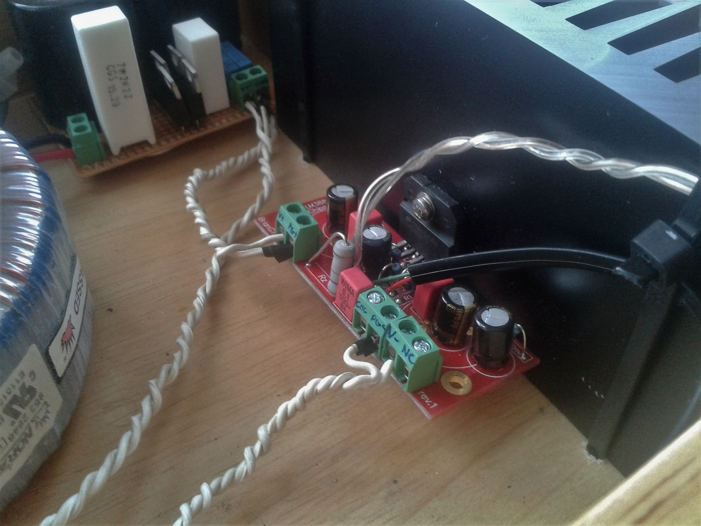
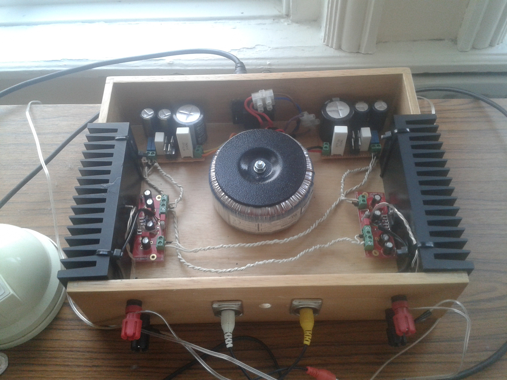

+++
authors = ["Adam Piekarski"]
title = "LM3886 Chip Amp (Gainclone)"
date = "2023-09-23"
description = "A high-power audio amplifier using the infamous LM3886 chip"
tags = [
    "amp",
    "amplifer",
    "chipamp",
    "lm3886",
    "gainclone",
]
categories = [
    "hardware",
]
series = ["Theme Demo"]
aliases = ["migrate-from-jekyl"]
+++
A high-power audio amplifier using the infamous LM3886 chip

# Amplify Now.

## Background
The original Gaincard amplifier by 47 Laboratory, released in 1999, defied all the elders' wisdom of amplifier construction. Discrete transitors were ditched and a Texas Instruments LM3875 operation-amplifier sat in the heart of it all - you can read more about it [here](http://www.6moons.com/audioreviews/47labs5/gaincard.html).

Shortly after the Gaincard was released, the DIY community embraced its controversial design and started creating clones, leading to the portmantau Gainclone.

As a big music listener and someone that loves to make things, I married the two together by deciding to build a power amplifier.

## The Power Supply
Nothing particularly inspired here - the circuit resembles the [Chipamp.com snubberized power supply](http://chipamp.com/product/snubberized-chipamp-power-supply-kit/) with the addition of an extra 4400μF capacitance on each rail.

At the real heart of the power supply sits a huge centre tapped toroidal transfomer. Rated for 225VA, it is more than capabable of delivering the peak current that the amplifier will demand during loud sections of music. On a good day it should output +/- 25V, however this is dependant on the AC mains supply and the load placed on the power supply.

The power supply is built on two mirrored perfboard's: one positive rail, one negative rail. The bridge rectifier on each board is built from four MUR860 diodes, coupled with Panasonic HA and FC capacitors all rated at least 50 volts.

## The amplifier boards
Just as before, I have used the Chipamp.com design - utilising their PCB's. To make sure I got the most of out of LM3886 chip within a reasonable budget, I have used Panasonic FM for the large capacitors and WIMA elsewhere.

The image below shows one of the amplifier boards (without the LM3886 chip). The terminal blocks, from left to right, resemble the following:

* V+ - Positive voltage rail (+35V)
* PG+ - Positive ground
* CHG - Chassis ground
* PG- - Negative ground
* V- - Negative voltage rail (-35V)
* NC - Not connected

Once the LM3886 was soldered onto the amplifier board, the chip was mounted onto a rather large black heatsink. The clear braided wire is the speaker output, while the green and red wires with an black outer case carry the input signal to the board.

## The front
Not a particularly aesthetic pleasing front, nevertheless it's very functional. On the edges are red and black binding posts which are the positive and negative speaker outputs, while the centre is occupied by two RCA plugs as an input. The centre hole currently remains empty, a future modification will be to add a volume potentiometer.

## The Finished Product
A drawer has been repurposed to be the case for this amplifier. Sitting right in the centre is the transformer, the power supply boards are neatly tucked behind, with the positive rail on the right and the negative on the left. The back of the amplifier features an [IEC C13 connector](https://en.wikipedia.org/wiki/IEC_60320#C13.2FC14_coupler) (usually found on desktop computers) for AC power. The two amplifier channels flank the sides, attached to the protruding heat sinks.

## Performance
There is plenty of analysis and praise about the LM3886 in DIY all over the internet, anything I would add would just be noise so I'll keep it short! I have this amp hooked up to a pair of [DALI Zensor 1's](https://www.dali-speakers.com/media/3222/dali-zensor-whitepaper.pdf) which sit on my desk - the combination is fantastic, the staging is deep and engaging plus there is plenty of power to fill my small room. What more can you ask for!
