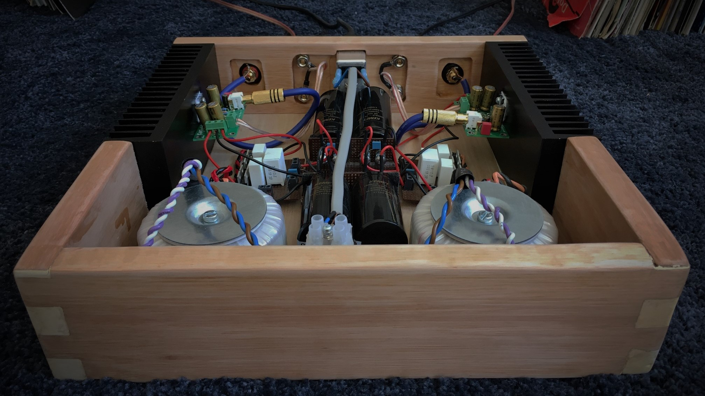
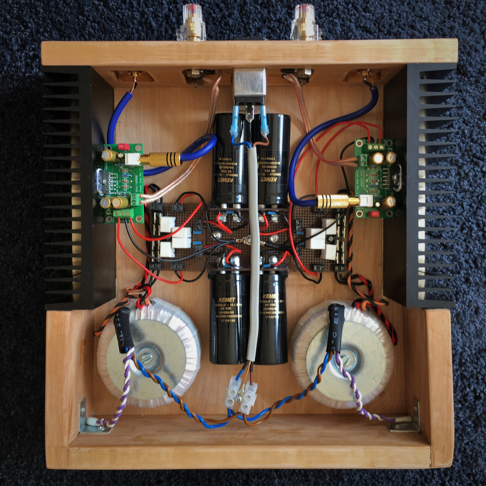
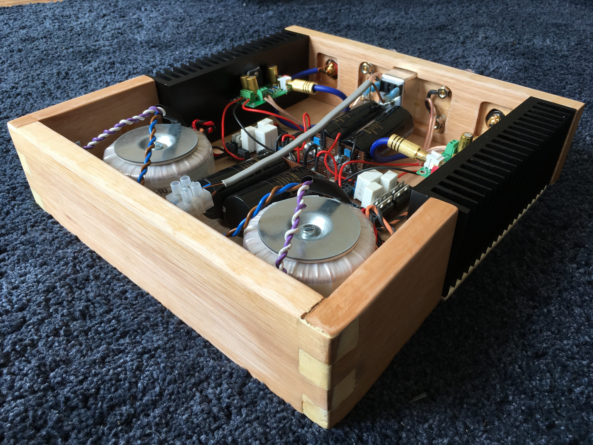
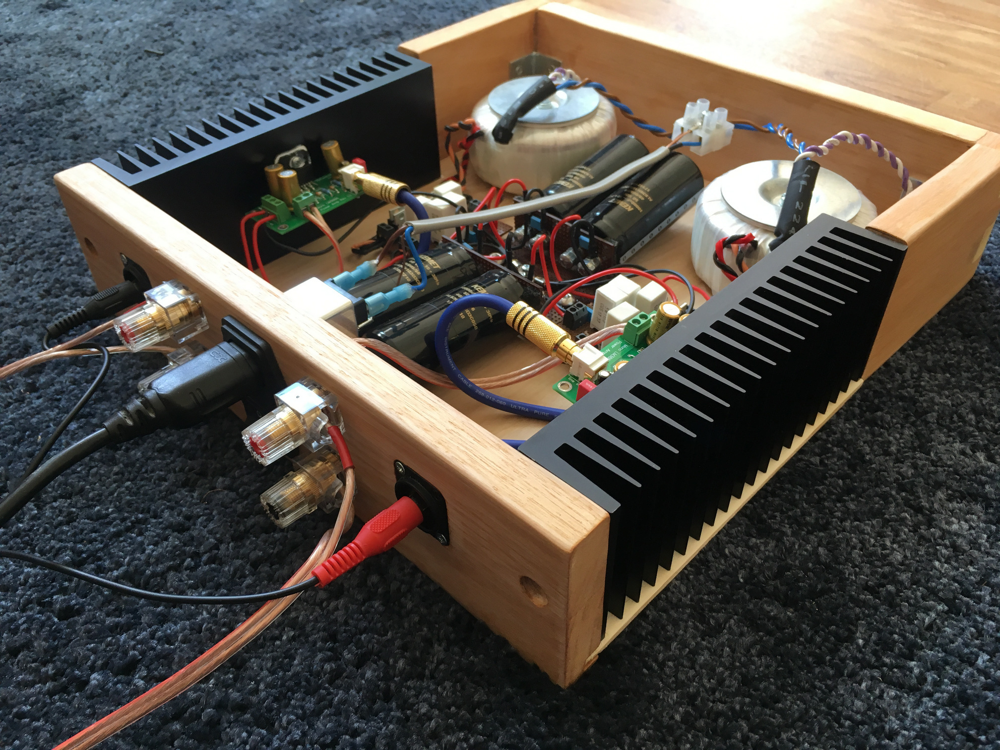
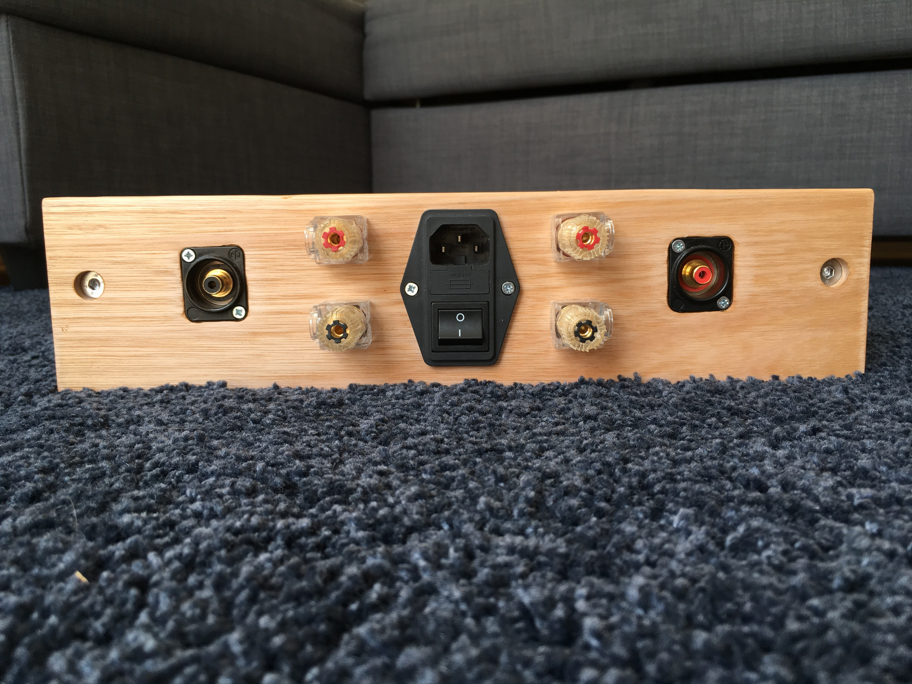
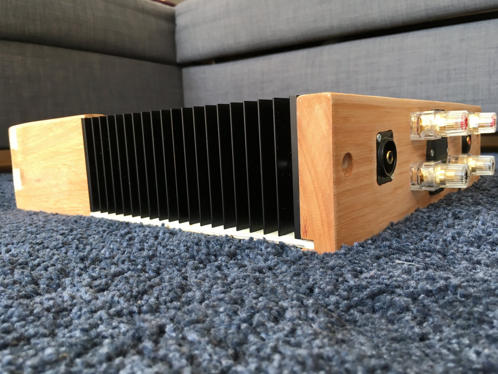
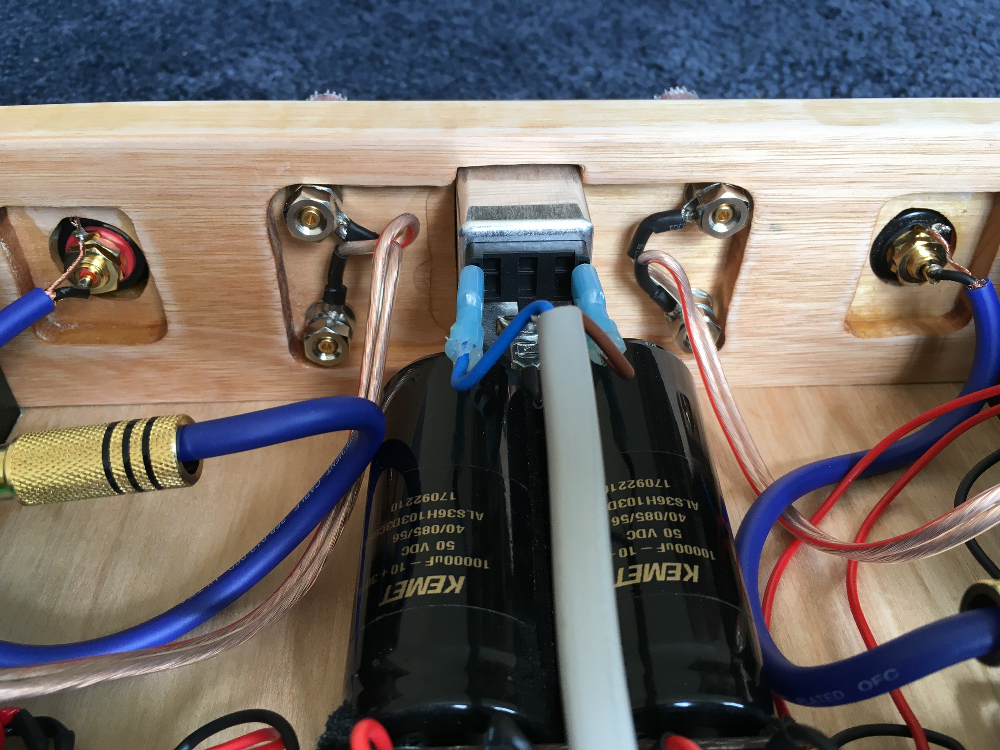

+++
authors = ["Adam Piekarski"]
title = "Dual mono LM3886 chip amp"
date = "2023-09-23"
description = "My second endeavour into building an audio amplifier"
tags = [
    "amp",
    "amplifier",
    "dual mono",
    "lm3886",
    "gainclone",
    "chip amp",
]
categories = [
    "hardware",
]
series = ["Theme Demo"]
aliases = ["migrate-from-jekyl"]
+++
My second endeavour into building an audio amplifier

## Round Two.

### Background
After successfully building a [LM3886 amplifier](/projects/amp) a couple of years ago, I decided it was time to build another one, be a bit ambitious with it and create something with a bit more oomfph. My previous attempt is still very capable, but is now starting to fall to bits because I didn't own appropriate tools to produce a solid enclosure. Loaded with an arsenal of new tools this project has given me a lot of woodworking experience which I never really exercised during my first build.

### Technical Overview
As with any class AB amplifier, a good power supply is paramount. I have chosen to go with a dual mono configuration so there are two independant and unregulated power supplies which are mirrored down the centre. They resemble Carlos Fillipe's ["Unregulated PSU for audio amplifiers"](images/psu.gif) - I believe these are BrianGT's interpretation.

Each channel contains a [120VA 2 x 24V transformer](https://uk.rs-online.com/web/p/toroidal-transformers/7529261/) by RKD and two [KEMET 10000uF 50V resevior capacitors](https://uk.rs-online.com/web/p/aluminium-capacitors/8696325/). The transformers have very little mechanical hum and have dual-voltage primaries just incase I ever want to run the amplifier on 110V mains.

The LM3886 chips sit on a PCB by [KMTech](https://www.ebay.co.uk/itm/Quality-LM3886-based-mono-amplifier-Chipamp-Gainclone-PCB-only-DIY-Audiophile/112887774780) along with [100uF Nichicon FG Series](https://uk.rs-online.com/web/p/aluminium-capacitors/6022668/) as power decoupling capacitors. They are a relatively neutral and compliment my DALI Zensor 1's well, but I may look at experimenting with different capacitors - I could benefit with a larger low-end. The resistors have all been hand-matched to be within 1% tolerance.

## Gallery
Enclosing the amplifier is a custom built wooden case. The front and rear are solid pieces of Red Grandis (Eucalyptus Grandis) held together with a base made from [Metsä Wood Spruce](https://www.metsawood.com/) plywood and supported by the aluminium heatsinks which flank the sides.

This was the first project I've completed that encorporated the use of a router. Since the Red Grandis stock was 25mm deep, the router enabled me to recess parts of the wood so I could mount components to it. It also was used to cut through dado joints so the base could fit snuggly to the rest of the wood.

## Onwards
I thoroughly enjoyed constructing this amplifier and the finished result provides more than enough drive for my speakers. For a casual listen, I'll use a Raspberry PI with a [Pi-DAC Pro](http://iqaudio.co.uk/hats/47-pi-dac-pro.html) and the open source Spotify client [Raspotify](https://github.com/dtcooper/raspotify). Otherwise, my pair of 1210's and a mixer feed the amplifier when I want a little bit of fun.

The amplifier does not have a lid at the moment: a glass screwed into the top is the top candidate at the moment, similar to the top on my previous amp so everyone can oogle inside. Another area of improvement are the finger joints on the front - they were a little messy and required a lot of wood filler. Next time I would look into using router jigs to get better precision.
