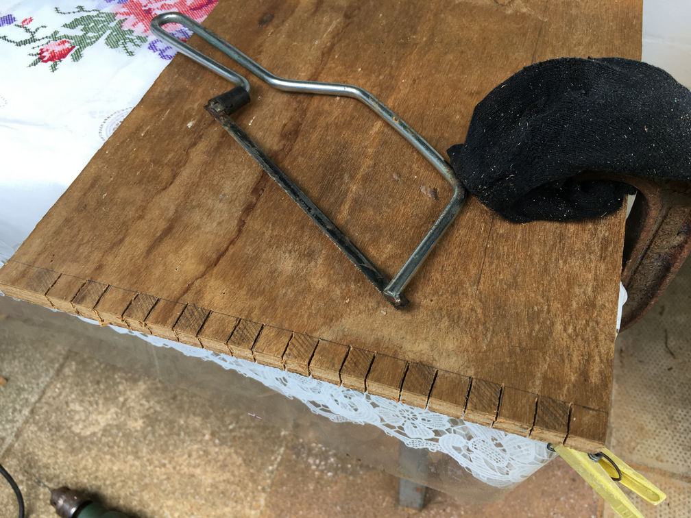
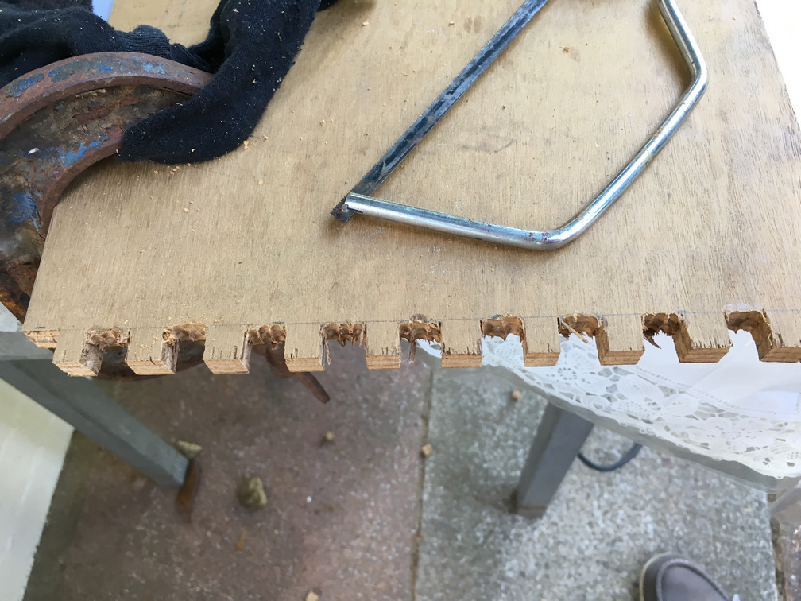
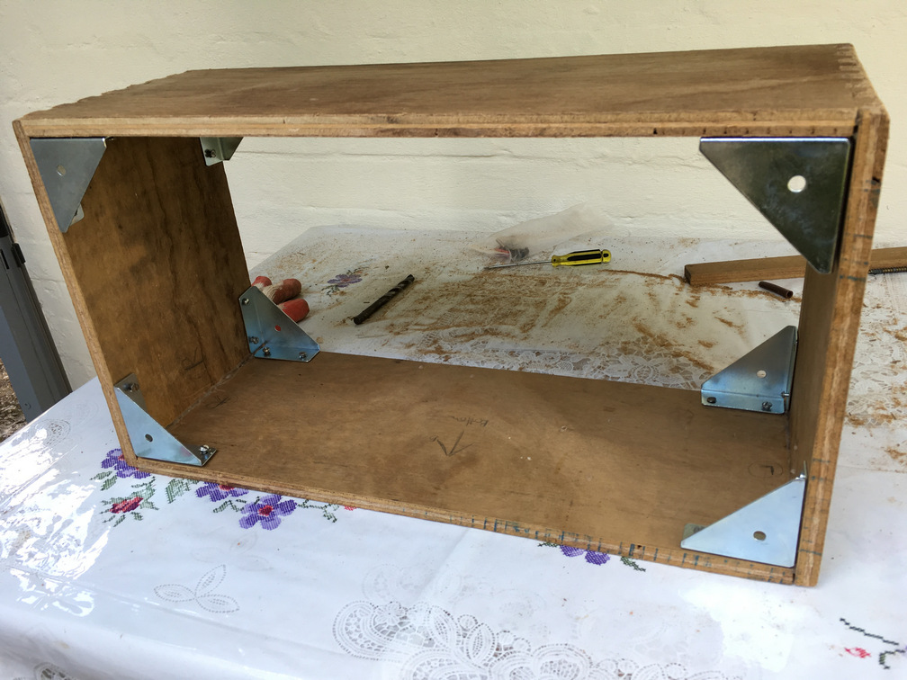
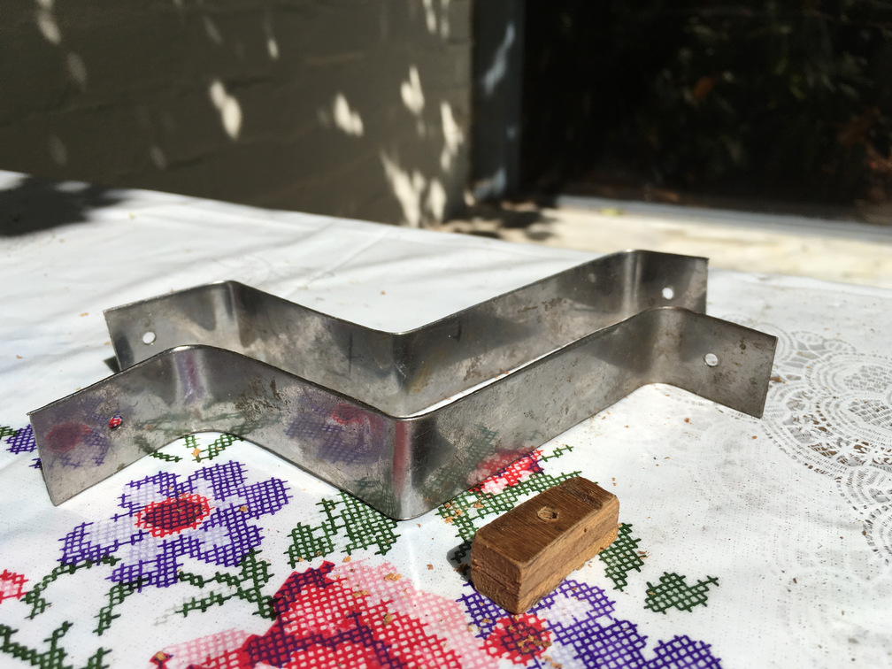
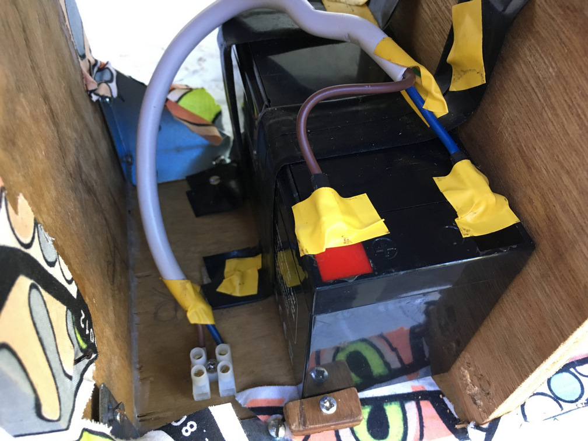
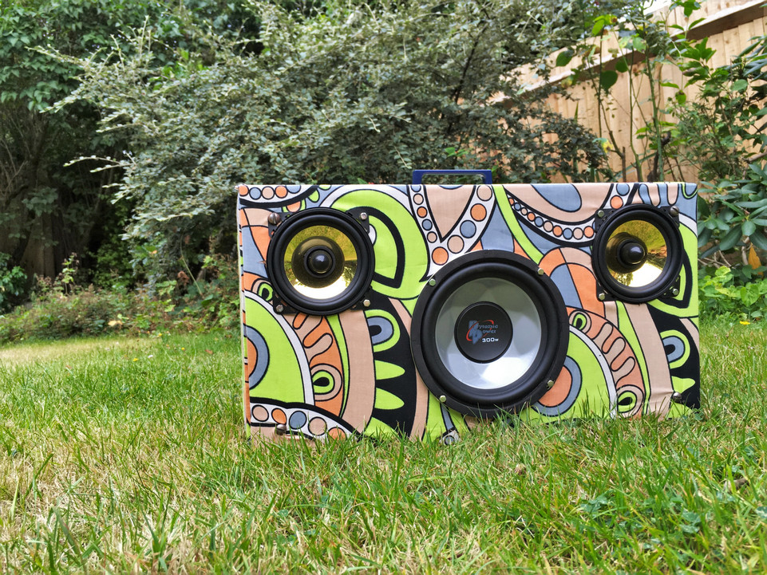

+++
authors = ["Adam Piekarski"]
title = "Boombox"
date = "2023-09-23"
description = "My take on creating a boombox - a 10kg booming monster"
tags = [
    "amp",
    "amplifer",
    "boombox",
    "speakers",
]
categories = [
    "hardware",
]
series = ["Theme Demo"]
aliases = ["migrate-from-jekyl"]
+++
My take on creating a boombox - a 10kg booming monster

## How I made it:

### Front design in SketchUp
This is my initial idea of two full range drivers and one "subwoofer" driver to deliver the bass.

I was a little enthusiastic with the dimensions and the finished product is a lot smaller than this.

### Back design in SketchUp
Three chambers - one for each speaker. On the left sits a sealed lead acid battery for power and on the right are two amplifiers: one for the small full-range speakers, the other the power the sub.

### Main Material
Some scrap 5/8" plywood I had lying around.

### Bottom and side
Based from the measurements I made in SketchUp (21" x 12" x 9"), I cut out the bottom and side. The sheer size then became apparent and after a few calculations I decided to reduce the size to 18" x 10" x 7".

### Preparing the box joints
Measured out boxes 5/8" (the same thickness as the plywood) and made the cuts with a hack saw - yes I'm guilty of using a metal blade with wood!

Also guilty of using a sock with my clamp to protect the wood :)

### Boxing out the boxes
Drilled a few overlapping holes until I could snap out the alternating boxes.

### Cleaning up the boxes

### Almost all the wood I need
On the left sit the top and bottom pieces, the sides are in the centre and the front/back baffles complete the set on the right.

### Dry fit
A little rough round the edges, but nice and stiff nevertheless!

### Gluing the main frame
Just your bog standard wood glue in between the box joint. Wish I had some clamps for this bit.

### Marking out the front baffle
Marked out the holes for the three speakers, some of the holes to mount them and the holes to mount the thing to the main box.

### Cut out the driver holes
Drilled a hole, cut roughly with the jig-saw and finished with the file.

### Ooops
Cut one of the holes a little too big so I created a wood glue/sawdust paste to patch up my shoddy work

### Corner Brackets
Added these zinc flange brackets for rigidity and more importantly, something to mount the front and back baffles to the main body of the box.

### Gluing the compartment separators
They are not part of the structural integrity of the boombox hence a tight fit and a spot of wood glue is enough.

### Now, time to get to the real nuts and bolts of it all
I apologise for the pun!

On the left are the nuts and bolts for the two full range speakers, the subwoofer bolts are in the centre and the front/back baffle mounting nuts/bolts complete the set

### Dry fitting the front baffle
The two full-range speakers share a bolt for mounting

### The amplifiers
I had these lying around - they are both 12V amplifiers, take audio in with RCA sockets and claim to put out around 20W of power into two channels (exaggerated marketing).

I used the top amplifier for the bass (since it is bridged) and the bottom amp to driver the two full-range speakers.

### Creating a 2-in-1 plate
Cut a piece of aluminium out and drilled holes such that both amplifiers can be mounted onto the same plate.

The black is just a protective film on the alu; this was my third attempt, ensuring everything was aligned was tricky.

### The amplifiers and their modifications
On the far left of both amplifiers you can see two wires shorted together with some tape on top - this means they are always "on" so I could connect a DPDT switch (top left corner) that can switch both amplifiers on/off at the same time.

Both amplifiers are connected with DC jacks which are connected to a power source, more on this later.

Hard to see in the image - I desoldered the supply capacitor of the top amplifier and "extended" its leads so i could fit the switch in.

This configuration is also safer as the original designs have the switches AFTER the input capacitors which is quite dangerous if you mix your positive/negative up.

### The control panel
The two amplifiers controls hooked up to the same plate plus a switch which switches both amps on/off simultaneously.

Unfortunately there is one key thing missing: audio input! Not to worry - I solve this later on.

### The speakers
I ventured into the world of car audio for these speakers:

The two golden full-range speakers are 4 inch "auna Goldblaster 4's"

The bass speaker is a Pyramid Audio PW677X.

They claim to handle any power that I am planning on throwing at them and claim to have a sensitivity of 89 and 86 db/W/m for the full range and bass, respectively.

### The exterior fabric
Picked up 6 1/2 yards of this very bold and colourful fabric from my local market.

I believe it's linen; it's quite thin but shall do the job in hand.

### Attaching the fabric to the front baffle
I am not in the possession of a fabric stapler or a nail gun, so I stretched the fabric over the wood and nailed the thing in by hand using small nails.

### Poke holes for the speakers

### Front baffle done!

### Covering the main frame

### Attached a handle
Found this little blue handle and though it'd match the aesthetics of the box - it is screwed in from the inside.

### Audio input!
The two amplifiers have RCA jacks for audio input and I dug out this long, lost and forgotten cable from the depths of my cupboard to solve this.

### Audio input
I created this female 3.5mm jack to 2 sets of male RCA jack.

I was quite torn between making this a bluetooth speaker, a bluetooth/3.5mm or just a 3.5mm wired speaker and decided I hate bluetooth receiving modules and just settled for a wired connection

### Power
The full-range speaker amplifier is class D (very efficient) however the other bass amplifier is class AB (not so efficient) so I needed a beefy battery to keep this thing going at the volumes I like to listen to!

Much much cheaper than lithium batteries too :)

Usain in the background after his 8th Olympic medal :)

### Battery
The battery sits on one side of the box and must be mounted to avoid it shaking around during transport.

### The battery mounted in the box
I cover the metal braces with electrical tape, hence why they are hard to see.

Covered anything metallic and carrying electrical current with electrical tape.

### Power
I needed something to gauge how much juice is left in the SLA battery so I purchased this cheap little voltmeter with LCD display.

Decided that it would be nice to power this thing from the mains and be able to charge it with the same port hence the switch and the DC jack.

### Power panel
A little messy and scratched up - but still very functional.

The switch is used to change between battery power and DC from a power supply.

### Finishing the back
Power section on the left, Audio on the right

### The final back panel
A lot of unseen changes here.

To the right of the voltmeter is a little push button so that the voltage is only displayed temporarily - this is done through necessity as the cheap meter spits out some interference which the amps pick up.

To the left is a little switch used to switch the DC jack's function - either charging the batteries or powering the amps. This was a little hacky and messy due to my lack of planning - oh well.

As mentioned, this boombox will receive audio through a 3.5mm jack which is now present on the top right corner of the amp plate.

### Hooking everything up
I poked some holes in the separators to thread the audio and power cables across chambers.

The electronics work perfectly under battery power; unfortunately the weather's not so bright under DC power. Anyone with electronic/audio experience will look at this circuit and notice that running two amplifiers from the same source is a classic recipe for a ground loop. As of writing, I await delivery for a ground loop isolator to solve this problem.

## Final Pictures
### 1

### 2

### 3

