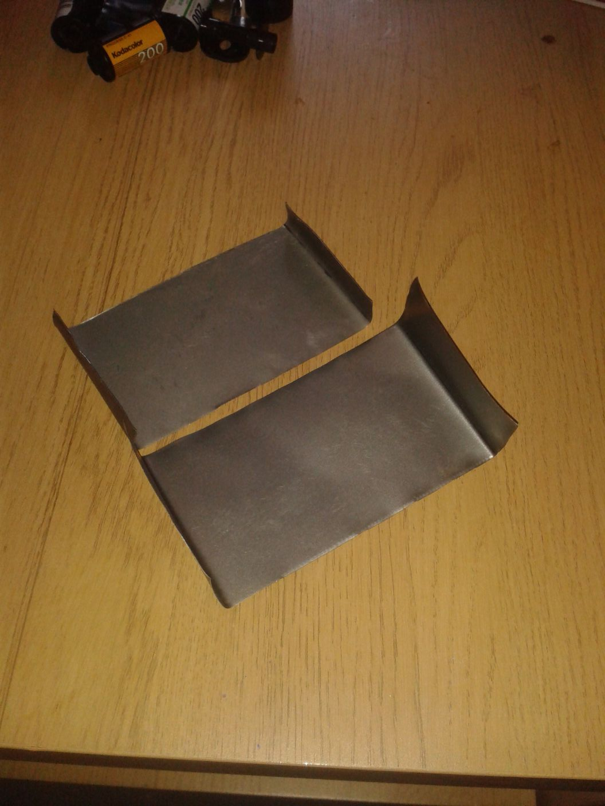
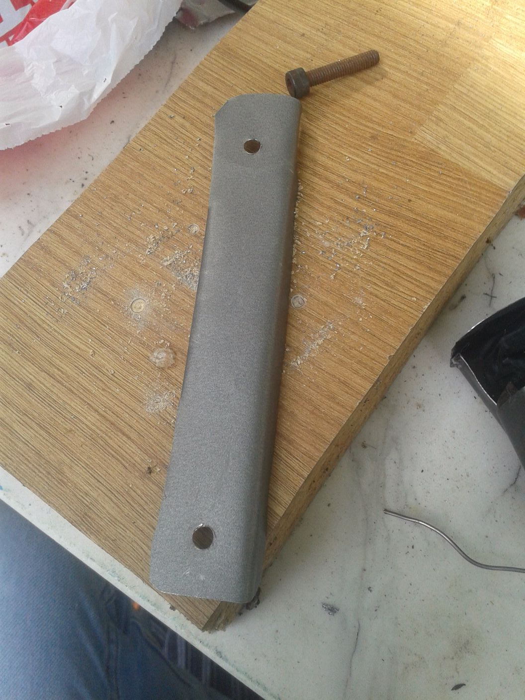
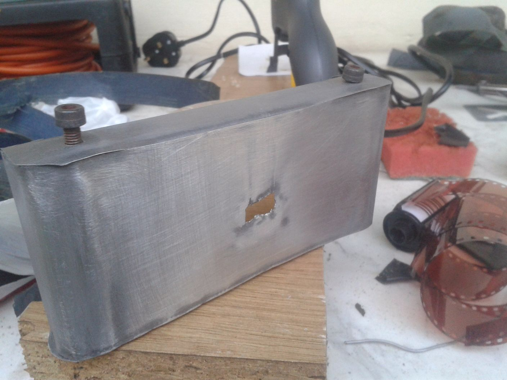
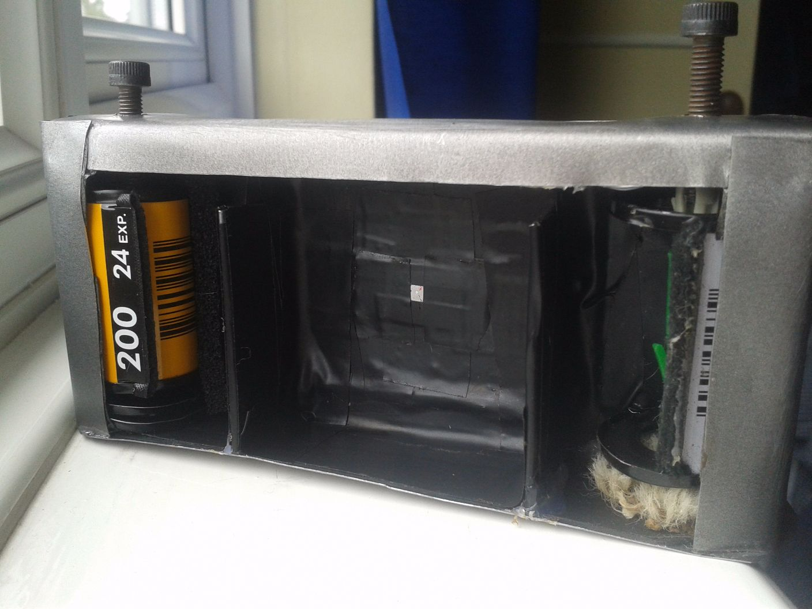
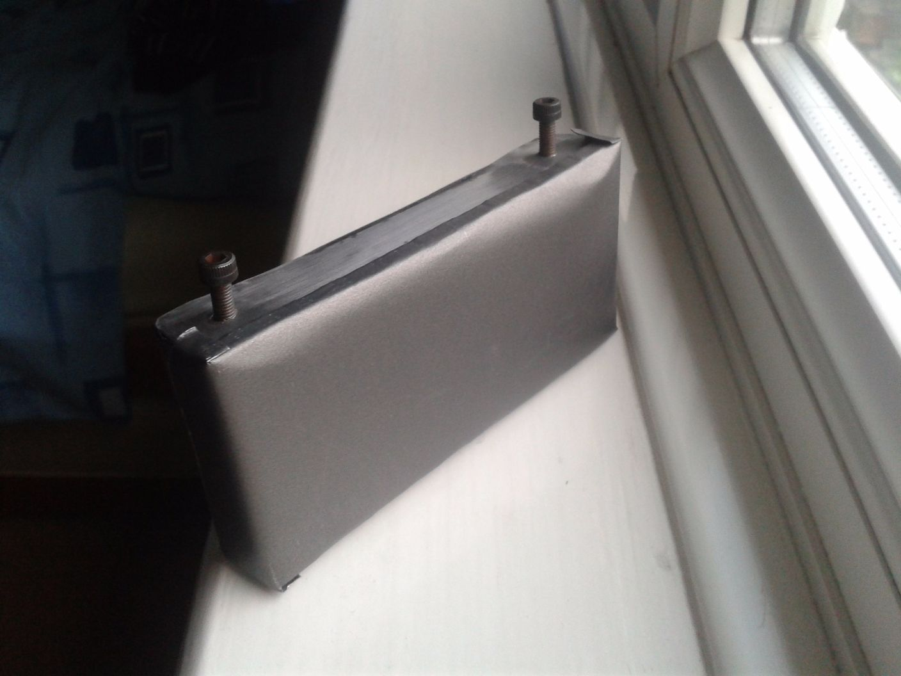
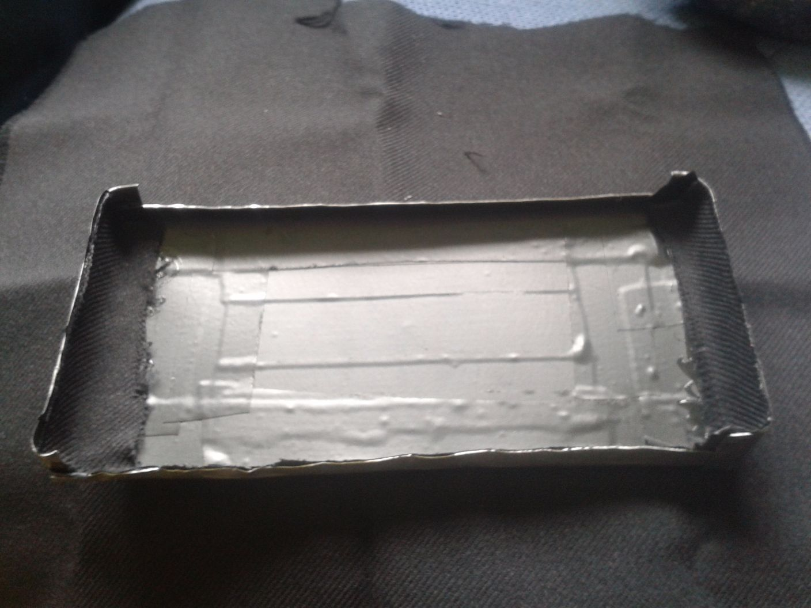

+++
authors = ["Adam Piekarski"]
title = "35mm Pinhole Camera"
date = "2023-09-23"
description = "A 35mm camera made from a couple of baking trays"
tags = [
    "35mm",
    "camera",
    "diy",
    "pinhole camera",
    "film",
]
categories = [
    "hardware",
]
series = ["Theme Demo"]
aliases = ["migrate-from-jekyl"]
+++

## How I made it:

### The humble beginnings
I picked up a couple of baking trays for the total price of 3 quid - very good value I must say!

### Initial body cut
You can cut through these trays with a good pair of scissors.

### Marking out the pinhole

### My very shoddy metalwork
The task of creating a hole in the middle of a sheet of aluminium without the aid of power tools was rather difficult.

I managed to work my way around this later on!

### Attaching a base to the back
I didn't even end up using this backplate in the end but I thought I'd share it!

### My initial bodies
Glue gun glue, superglue and black electrical tape were my weapons of choice for attaching different parts to the body.

At this point I ditched the backplate on the left and concentrated on the front of the camera

### The front
I attached the bottom to the front part of the camera and taped up the inside of the camera to minimise internal reflections in the camera.

The two small pieces at the bottom are dividers which form the frame for the film.

### Tension!
I found a little patch of carpet laying around and stuck it on the right side of the camera.

This is used to create tension in the take-up-spool for the film.

### The top
Drilled two holes to provide access to the film.

### The dials
The area to the left is where a 35mm film canister is loaded and then screw is then used to rewind the film when unloading the camera.

On the right the screw is used to advance the film between every shot. More details to follow!

### Light proofing the holes
I drilled (punctured may a better way to describe it) a hole in the top of the enclosure and threaded a camera cable through it.

Added some fabric to the underside of the holes on the top to minimise light which could enter via these gaps.

### First attempt for a take-up-spool
So I took a spent film canister, opened it up, did a bit of sawing and flipped it all round all to discover this was a terrible idea!

### Polishing
After deciding my take-up-spool was terrible I decided to scratch away the teflon coating from the baking trays to create a brushed aluminium look.

### Mess
Don't work like this!

### Take-up spool v2
Believe it or not but I took a couple of wall plugs I had lying around and attached them to the screw to form the take-up spool.

### Take-up spool v2
Old spindle out. New plugs in.

### More tension
My carpet idea didn't seem to create enough tension for the film so a paper-clip positioned in a strange manner was just what the doctor ordered.

### Rewind knob
The end of a paperclip super-glued to the end of the film rewind screw provided the means to rewind film in the canister.

### Creating the pinhole
The oven tray aluminium was too thick to create a pinhole small enough so once again beer saves the day!

### The Pinhole
Pierced with a sewing needle. Approximately 0.4mm wide.

### The Pinhole
Just a little test

### Attaching the dividers and taping it all up
I attached the dividers to the front of the camera.

They are 54mm apart (as opposed to the standard 36mm) as I wished to create a camera which would shoot ultra-wide photos - this unfortunately become redundant as explained later.

### Film test
I loaded a junk developed roll of film into the camera to test it out: all seems swell.

### Back plate number two
My first backplate in the beginning of the album was inadequate so I remade it using a single piece of "baking tray".

### Snug fit

### Lightproofing
Added some fabric to ensure no light can enter the camera between the front and back bodies of the camera.

### More lightproofing
Same business on the front of the camera

### Fixing my mess
I cut more aluminium from the can and cut a large hole to cover up my terrible hole making.

### Mounting screws
These are M3 screw nuts which should enable the camera to be attached to most tripods.

### Attached to the base of the camera

### Done and dusted
I unfortunately I didn't take more pictures of the finished product.

I used a bit of card and tape to create a shutter, not very accurate or pretty, but it seemed to get the job done :)

## Sample Pictures
I initially hoped for a wide aspect ratio but it seems my shoddy metal work blocked light from entering the camera at extreme angles.

With a 0.4mm pinhole and approximately 25mm between hole and film, the camera had a fixed f-stop of ~62.5. I did a few exposure time calculations when taking photos and even used a light meter for some but as my shutter was completely manual it was rather silly. In sunny conditions I opened the shutter for 1 second, in the shade 4-10.

### A pathway

### Road
And a not so good one :(

Getting the exposure right for photos was a bit tricky.

