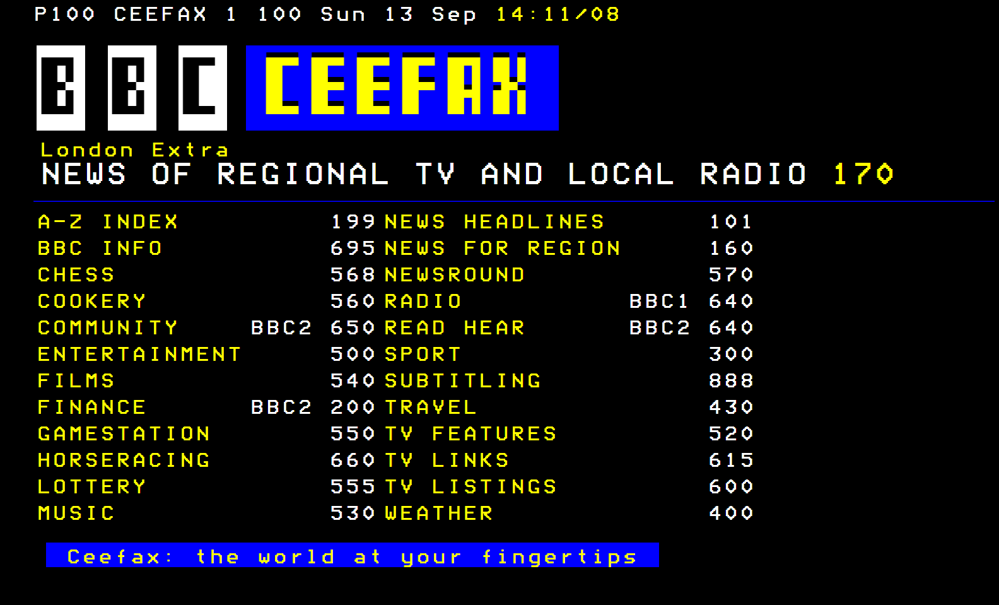
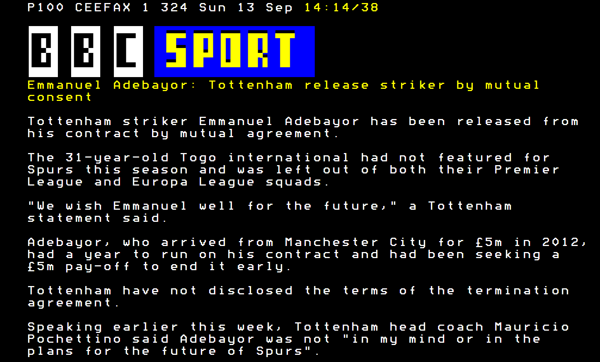

+++
authors = ["Adam Piekarski"]
title = "Ceefax 2015"
date = "2023-09-23"
description = "A modern twist to an old favourite"
tags = [
    "ceefax",
    "web",
    "nodejs",
    "javascript",
    "bbc",
]
categories = [
    "software",
]
series = ["Theme Demo"]
aliases = ["migrate-from-jekyl"]
+++

A modern twist to an old favourite

## Take me back to 1974
## Now.

### The idea
Since the launch of Ceefax, over 40 years ago, it has gifted a generation before the internet with on-demand, up-to-date news from the comfort of sofa's across the country. Despite being born just before the big internet boom, Ceefax still played a part of my childhood so naturally I was devestated when it [ceased to broadcast](http://www.bbc.co.uk/news/uk-20032882) along with analog terrestrial television.

The BBC red button service works; while it is just as effective as its predecessor, the new digital service just lacks the same magic Ceefax captivated. This inspired me to recreate some of the "old ceefax" for the web.

A live demo can be found [here](/ceefax/index.html), bare in mind not all pages are implemented (a list of available pages can be found below

### Home
Ahh, nostalgia. All navigation is performed by typing the page number directly in the web page.

### Headlines
Page 101 in all it's glory with modern headlines.

### Sport
The stories are all pulled from the BBC Website and condensed to the first six lines of every article.

## The implementation
All this information and the source code to Ceefax 2015 can be [found on my github](https://github.com/fatcookies/ceefax2015).

Just a note that: The "BBC" Logo and all content belong to the BBC, you must comply with their [terms](https://www.bbc.co.uk/usingthebbc/terms) to use this app.

### Requirements
- node.js
    - [Cheerio](https://github.com/cheeriojs/cheerio)
    - [Feedparser](https://github.com/danmactough/node-feedparser)

### Installation
* Modify Node server to connect, default is `http://localhost:8080`
* `npm install cheerio`
* `npm install feedparser`
* `node node/app.js`
* Copy web folder to public web server

### Current Index (Implemented Pages)
* 100 - Home
* 101 - Headlines
* 104-115 - Headline Stories
* 300 - Sports Home
* 301 - Sports Headlines
* 302 - Football
* 303-314 - Football Stories
* 320-331 - Sports Stories
* 340 - Cricket Headlines
* 341-352 - Cricket Stories
* 500 - Entertainment Headlines
* 501-512 Entertainment Stories
