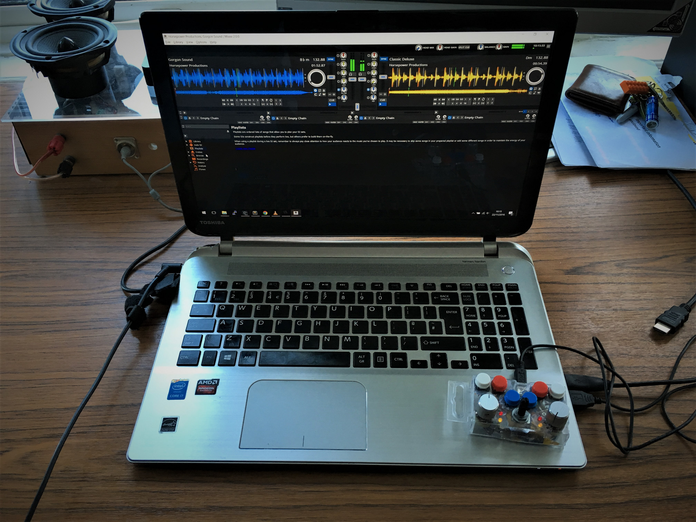

+++
authors = ["Adam Piekarski"]
title = "DJ Controller"
date = "2023-09-23"
description = "A very compact Arduino based DJ Controller"
tags = [
    "dj",
    "arduino",
    "music",
]
categories = [
    "hardware",
]
series = ["Theme Demo"]
aliases = ["migrate-from-jekyl"]
+++
A very compact Arduino based DJ Controller


## How I made it:

### The enclosure
I had a couple of these nuts and bolts storage boxes lying around and they seemed to be the perfect size for this tiny beast.


### Drilling out the component holes
Drilled out three different types of holes for the potentiometers, push buttons and LED's. A bonus hole right at the back for the mini-USB port required to hook the thing up!


### Dry fit
Testing if all the components will fit in their predetermined holes.


### The brains
An Arduino Nano clone provides the interface between the PC and the physical device. With 14 digital and 10 analogue pins - every component can be connected directly to the microcontroller.


### Quick schematics
The top left describes how the potentiometers are connected to nano - The GPIO will read a voltage between 0-5V and convert this into a digital value between 0-1023.

The top right shows the push button - when open the 5V supply will go straight to ground through a 10K resistor, when pressed, current flows straight through to an input pin on the nano which we can read.

The bottom schematic is an LED connected to a current limiting resistor - 220Ω was chosen. Since it is connected to a GPIO pin it can be switched on and off on command.


### The push button
An example push button wired up, ready to be placed in the enclosure and connected to the nano.


### All components in place
The potentiometers are all held in place using a nut, whereas the push buttons and LED's had to be secured using hot glue. I hate hot glue.

The Arduino Nano sits in the centre of the case, wedged between the sides.


### Mess in progress
There are a lot of wires to deal with in a very small space.


### Finished wiring
Very messy!


### Nearly finished
Everything is connected and enclosed but the knobs and buttons aren't fun to press!


### Finished article
Stuck some arcade style buttons on and brushed aluminium knobs onto two of the pots.


### Beauty shot

### Finished

### Finished
The plan was to build a very cheap and portable DJ Controller.

The result - three potentiometers, six push buttons and four LED's which are all user configurable.


# Software

### Arduino code
I quickly hacked together some Arduino code to read all the inputs and send changes as MIDI commands over the USB port (serial). The [code](dj.ino) is as follows:

```C
// Based on http://www.instructables.com/id/Easy-3-Pot-Potentiometer-Arduino-Uno-Effects-Midi-/step4/The-Code/

// Current and previous value of all three potentionmeters
int pots[3][2] = { {0,0}, {0,0}, {0,0} };

// All button states (1 = has been pressed down, 0 = released/not pressed)
int state[6] = {0,0,0,0,0,0};

void setup() {
   Serial.begin(57600); // Set the speed of the midi port to the same as we will be using in the Hairless Midi software 
   digitalWrite(3,HIGH);
   digitalWrite(4,HIGH);
   digitalWrite(5,HIGH);
   digitalWrite(6,HIGH);
}

void loop() {
  // Left bass
  handlePot(3,1);

  // Right bass
  handlePot(6,2);

  // Crossfader
  handlePot(5,3);

  //left white
  handleButt(9,0);
  //left red
  handleButt(8,1);
  //left blue
  handleButt(7,2);

  // right blue
  handleButt(12,3);
  //right red
  handleButt(10,4);
  //right white
  handleButt(11,5);
    
  delay(10); //here we add a short delay to help prevent slight fluctuations, knocks on the pots etc. Adding this helped to prevent my pots from jumpin up or down a value when slightly touched or knocked.
}

// Sends a MIDI message to control channel "number" on any pot change on physical "pin"
inline void handlePot(int pin, int number) {
     pots[number-1][0] = (1023-analogRead(pin))/8;   // inverse value and decrese
      if (pots[number-1][0] != pots[number-1][1]) { // Only send if change
          MIDImessage(176,number,pots[number-1][0]); // 176 = CC command (channel 1 control change), 1 = Which Control, val = value read from Potentionmeter 1
      }         
      pots[number-1][1] = pots[number-1][0];
}

// Sends a MIDI message to "number" for any full press on physical "pin"
inline void handleButt(int pin, int number) {
  if (digitalRead(pin) == HIGH) {
    state[number] = 1;

   } else {
    if(state[number] == 1) {
      MIDImessage(144,number,127);
      state[number] = 0;
    }
   }
}

void MIDImessage(byte command, byte data1, byte data2) //pass values out through standard Midi Command
{
   Serial.write(command);
   Serial.write(data1);
   Serial.write(data2);
}
```

### Connecting to a PC
Most music software supports contollers using the MIDI interface - unfortunately we only have access to a serial port using USB so a couple of utilities are required to trick the operating system to thinking we have a real MIDI device.

[LoopBe1:](http://nerds.de/en/loopbe1.html) Creates a fake MIDI port which music software can listen to.

[Hairless MIDI:](http://projectgus.github.io/hairless-midiserial/) Reads a serial port and converts messages to MIDI which LoopBe1 can read


### Configuring Mixxx
Mapped the MIDI controls to various controls in Mixxx.

The mapping file can be found [here](mixxx.xml)


## All working together

