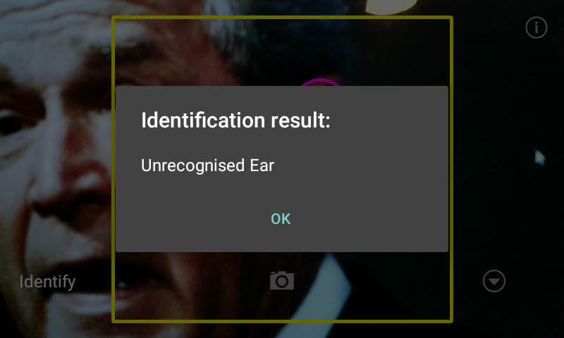

+++
authors = ["Adam Piekarski"]
title = "Eardentity"
date = "2023-09-23"
description = "An Android ear identification app"
tags = [
    "android",
    "computer vision",
    "biometrics",
]
categories = [
    "software",
]
series = ["Theme Demo"]
aliases = ["migrate-from-jekyl"]
+++

An Android ear identification app

### Using the ear as a biometric
Much of society strives to construct an unique and individual personality and some radically change their physical appearance so choosing a robust biometric to identify a human can be a challenge. Finger tips, iris, gait, face among others have been tried, tested and successfully rolled out - each with their own advantages and disadvantages.

In recent years the ear has emerged as a potentially useful biometric to suppliment existing solutions. Ears are more consistant than faces, do not change shape with different expressions or age and remain in a predictable position in the side of a head.

The relative positions of key parts of the ear such as the crus of the helix, the Tragus and the Concha can be used to form a reliable and robust identifier.

A small group of us decided to implement an Android app that can be used to identify people by their ears.

### Training
The app can auto-detect ears within a frame and can be trained from a single photo of an ear. This process can be described in the following three steps:

1. We detect an ear using Haar-cascade
2. We extract and describe ears using Local Binary Patterns (LBP)
3. We identify ears using Chi-squared test

### Managing Ears
Ears can be stored and managed on the phone, ready to be identified for the future.

### Identifying
Simply switch the mode to identify, point and shoot and wait for the identification.

### Download
Eardentity is officially available in the following places:

- [Google Play store](https://play.google.com/store/apps/details?id=org.adamp.eardentity)

