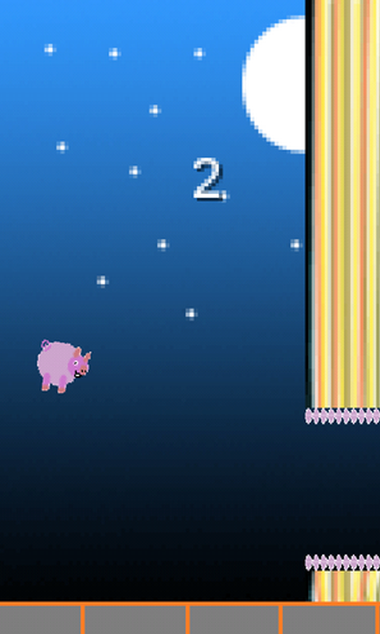
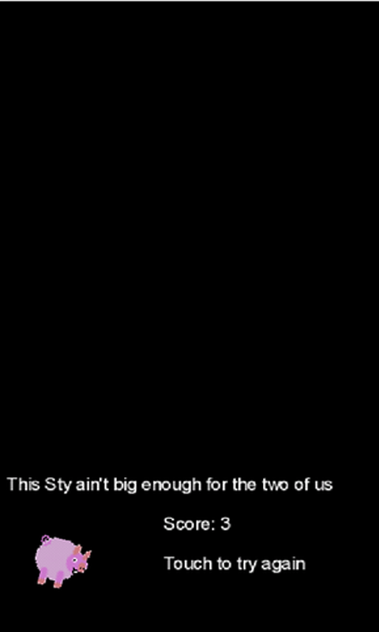

+++
authors = ["Adam Piekarski"]
title = "Piggy Fly"
date = "2023-09-23"
description = "A fast-paced casual Android game *cough* Flappy Bird clone *cough*"
tags = [
    "android",
    "mobile",
    "game",
    "gaming",
    "piggy fly",
    "flappy bird",
]
categories = [
    "software",
]
series = ["Theme Demo"]
aliases = ["migrate-from-jekyl"]
+++
A fast-paced casual Android game *cough* Flappy Bird clone *cough*

## When will pigs fly? Now.
### The backdrop
During the explosion of the Flappy Bird frenzy and consequent [demise](http://www.bbc.co.uk/news/technology-26114364), I decided to make a clone. The famous adynaton became a reality: Piggy Fly was born.

### Gameplay
There's not much to say here - you touch the screen; the pig flies. The physics is even more annoying than Flappy Bird's, so I wish you the best of luck!

### What people have said.
There might be a tad hyperbole here

#### Doctors hate him! One weird game!
Before I played this game, I was sad and lonely. But now I am a changed man and lost 10 lbs! Thank you Piggy Fly for changing my life.

#### 5\*
Piggy Fly is a super fun game that's using the latest technology on the market which makes it looks so stunningly good that comparing it's graphics to any other mobile game out there would be an insult.

#### Piggy Fly, not even once.
This game got me off meth and heroin, I now have to result to a mix of krokodil and brugmansia to stop playing it.

### Download
Piggy Fly is officially available in the following places:

* [Google Play store](https://play.google.com/store/apps/details?id=com.adamp.android.birdgame)
* [Amazon App store](http://www.amazon.co.uk/Cookie-Solutions-Piggy-Fly/dp/B00IZQQ4EC/)
* [Direct APK Download](PiggyFly0.3.apk) (from this website)
* Full source code available from [Github](https://github.com/fatcookies/piggyfly)
Try and beat my personal best of 12!

