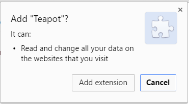
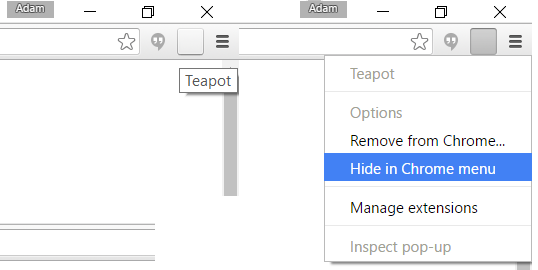

+++
authors = ["Adam Piekarski"]
title = "Facebook Teapot Spammer"
date = "2023-09-23"
description = "Prank your friends when they are away from their keyboards!"
tags = [
    "facebook",
    "javascript",
    "chrome",
    "prank",
    "web",
]
categories = [
    "software",
]
series = ["Theme Demo"]
aliases = ["migrate-from-jekyl"]
+++

## What is this?
A marvellous chrome extension which punishes your victims Facebook statuses if they go afk for too long!

The **source code** for this extension and **download** can be found on my [Github](https://github.com/fatcookies/facebook-teapot-spammer)

## What does it do?
Upon installing the extension onto your victim's computer, it will silently run in the background and detect if they are inactive from their computer for more than four minutes (this can be changed).

After four minutes the extension opens up a tab of Facebook, posts a random teapot status and closes the tab as if nothing as happened!

The time counter shall restart after the user has made some activity - this ensures only one status is posted per afk.

## Quick Installation
- Download the [packed extension](https://github.com/fatcookies/facebook-teapot-spammer/blob/master/teapot.crx?raw=true)
- Go to [chrome://extensions/](chrome://extensions/)
- Drag and drop the extension file, click "Add Extension" when prompted (shown below)
- The extension should load a **BLANK** icon at the top right corner of Chrome, this can be hidden completely as shown below:

## Advanced Installation
- The interval that the extension waits to post a status can be modified [here](https://github.com/fatcookies/facebook-teapot-spammer/tree/master/src/js/background.js#L7)
- Each status is randomly chosen from a pool of pre-written statuses, these can modified [here](https://github.com/fatcookies/facebook-teapot-spammer/tree/master/src/js/poststatus.js#L2)
- Refer to [Google's extension guide](https://developer.chrome.com/extensions/getstarted#unpacked) as to how to load.pack the modified extension.

## Current teapot statuses

- I am a teapot
- I am a well formed teapot
- I am a teapot and I have a spout
- I am a pot that houses tea, colloquially known as a teapot
- I am a pot full of tea - a teapot you could say
- They said I could be anything I wanted to be, so I became a teapot
- I'm a little teapot, Short and stout, Here is my handle, Here is my spout, When I get all steamed up, I just shout, Tip me over and pour me out

## Disclaimer

I am not responsible for any loss of friends on Facebook, loss of actual friendship, divorce, nuclear war or humiliation caused by the use of this extension.

