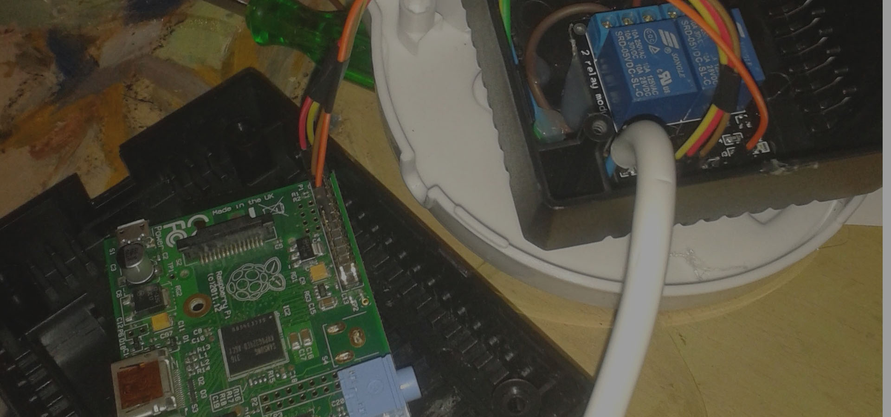
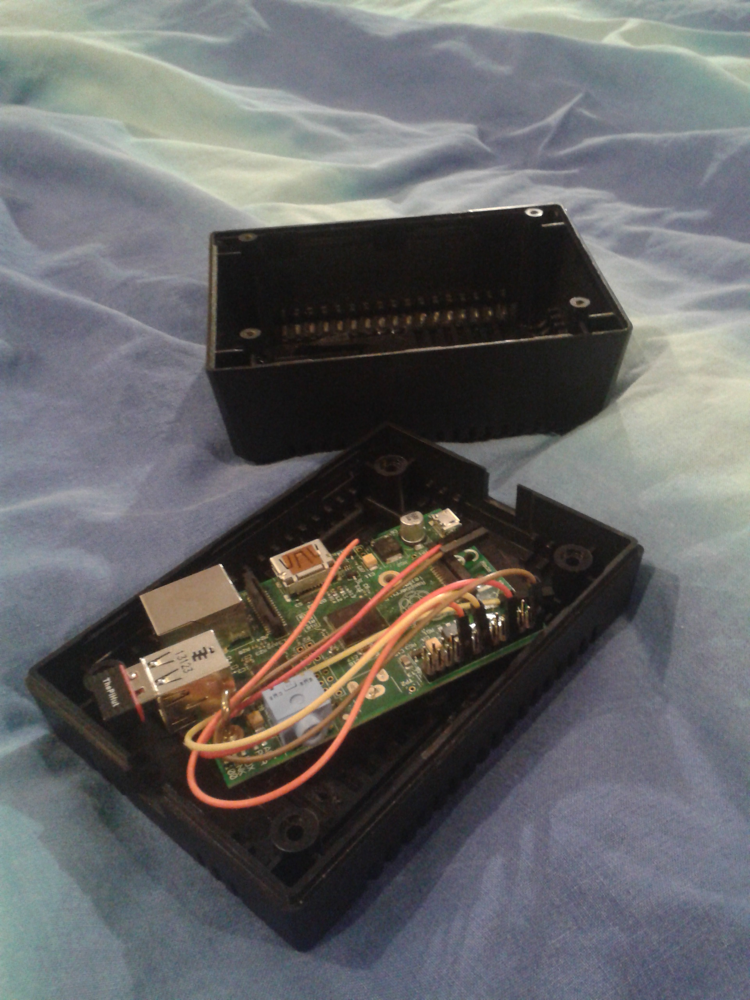
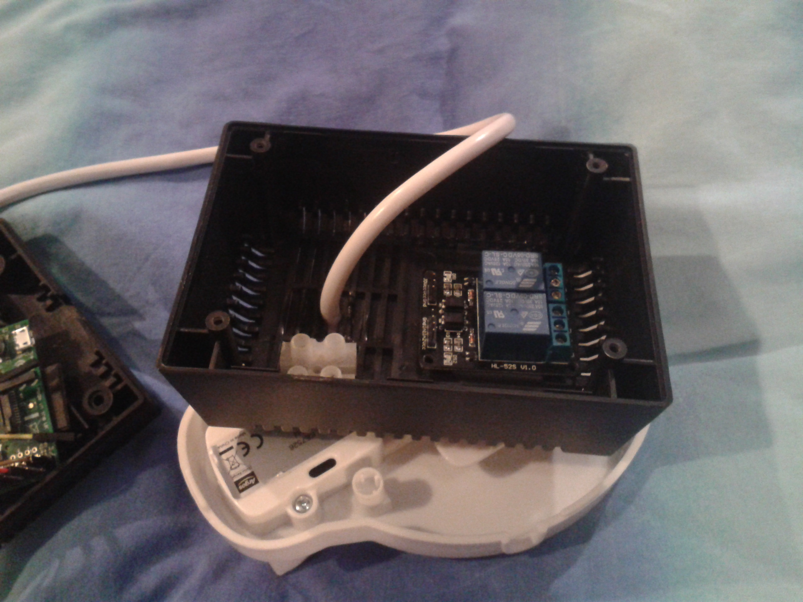
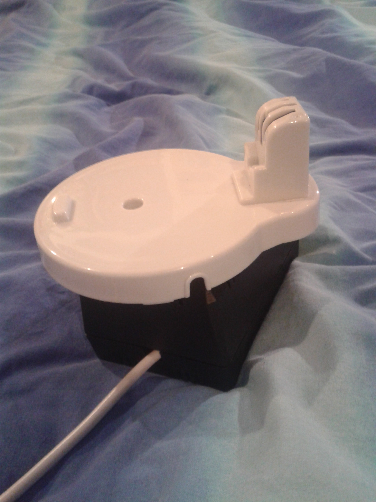
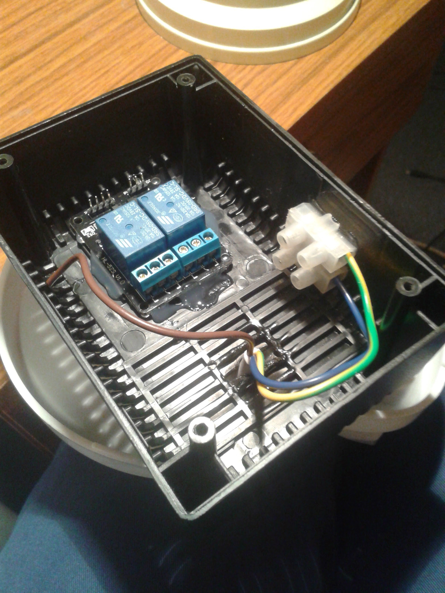
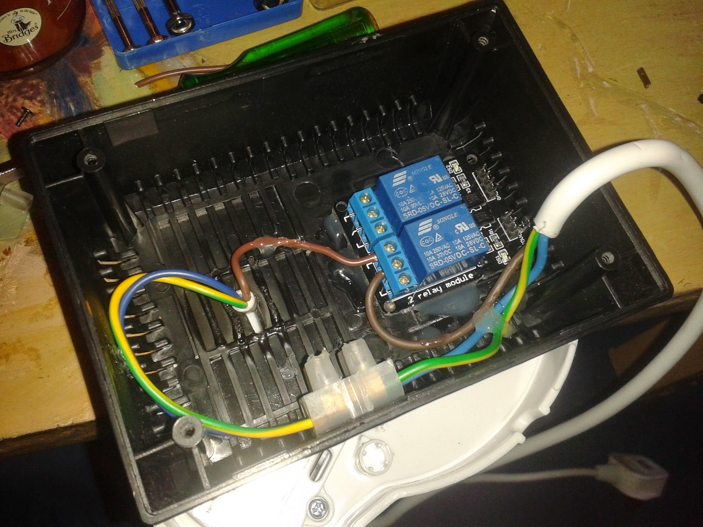
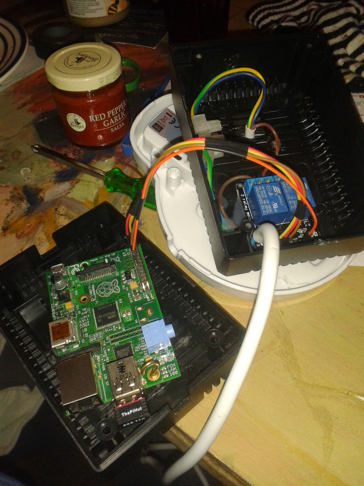
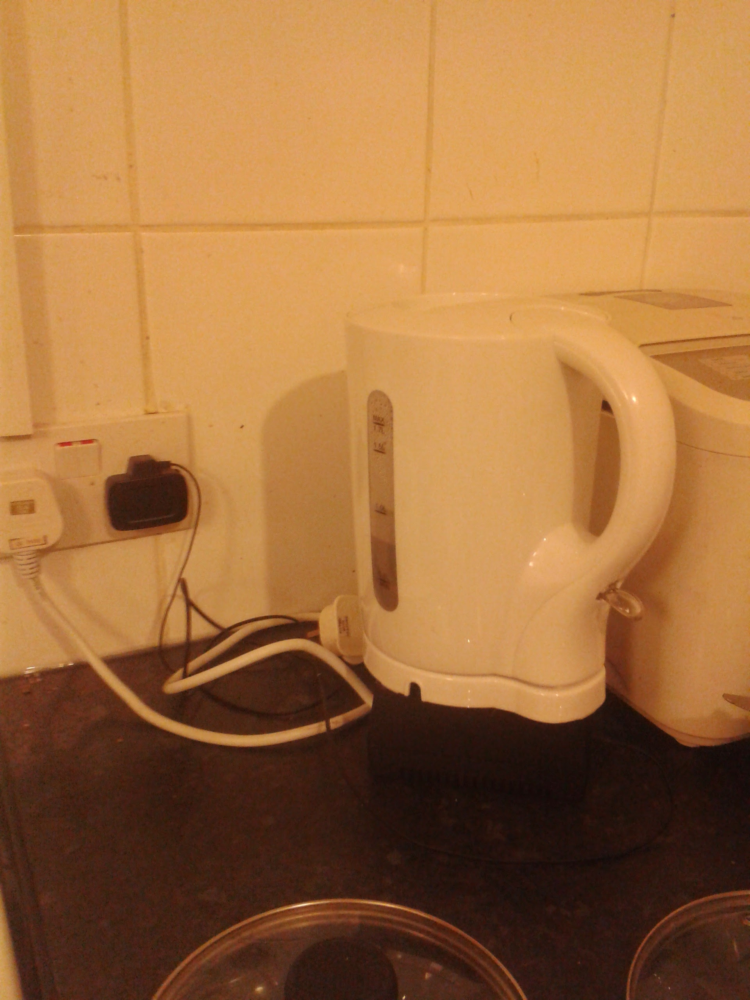

+++
authors = ["Adam Piekarski"]
title = "WiFi Kettle"
date = "2023-09-23"
description = "After being inspired by the rather novel iKettle, I decided I could create my own WiFi enable kettle as a little project!"
tags = [
    "wifi kettle",
    "iot",
    "raspberry pi",
]
categories = [
    "hardware",
]
series = ["Theme Demo"]
aliases = ["migrate-from-jekyl"]
+++

After being inspired by the rather novel [iKettle](http://www.firebox.com/product/6068/iKettle), I decided I could create my own WiFi enable kettle as a little project!

## How I made it:

### The enclosure
One of the last components I actually bought - it's just a small power supply unit enclosure I picked up for a couple of quid from Maplin.

### Bottom side of the enclosure
I have many Raspberry Pi's lying around the house, I believe the one pictured is the first Model B. It's screwed down into the enclosure. Attached is a WiFi dongle from [ThePiHut](http://thepihut.com/products/usb-wifi-adapter-for-the-raspberry-pi) and an old 4GB SD card which I incidentally had to cut with scissors to fit into this enclosure!

### The kettle base
I drilled (punctured may a better way to describe it) a hole in the top of the enclosure and threaded a kettle cable through it.

As this was a cheap and cheerful project, the base you see belongs to a beautiful [2.2kW Argos Value kettle](https://www.argos-support.co.uk/instruction-manual/9016710-simple-value-kettle-wht.pdf) for the jaw-dropping price of a fiver :)

### Top side of the enclosure
Just a rough idea of what the final top looked like. To control mains electricity I am using a 2 way relay board designed for micro controllers/ardiuno etc rated for 250VAC, 10A. It can be found [here](https://www.amazon.co.uk/gp/product/B009P04ZKC)

Also pictured is a chock block which I used for the earth and neutral wires (see below for more information)

### What it looks when finished (but before I actually finished it)
Just a little check to see if everything would fit!

### Glue Glue Glue
I used a high temperature (210c) glue gun to secure both the base and relay board to the top half of the enclosure.

I stripped the kettle cord to expose the wires in the photo

### Connecting the kettle up
As previously mentioned, I used a chock block to hook up the kettle earth and neutral to the plug.

### Hooking up the cord to the kettle/relay
The camera is not very flattering here, glue is messy!

### Hooking the Pi to the relay board
The relay board requires a 3.3V, 5V, GPIO out and earth pin which are served by the Pi.

### The software
The below description and code is avaiable on [Github](https://github.com/fatcookies/wifikettle)

#### Dependencies
- Raspberry Pi with an active WiFi/internet connection
- [WebIOPi](http://webiopi.trouch.com/)
- OPTIONAL: The kettle hardware/relays etc

#### How to install/use
1. Once you have WebIOPi installed on your Pi, you must replace or edit /etc/webiopi/config to match the [one in this reposistory](https://github.com/fatcookies/wifikettle/blob/master/config)

2. If you have not modified the [config file](https://github.com/fatcookies/wifikettle/blob/master/config), you must copy and paste the contents of [www/](https://github.com/fatcookies/wifikettle/blob/master/www/) into /var/www or wherever you wish to store your web pages.

3. By default the web-service will toggle GPIO 17, if you wish you change this you will have to modify config and [kettle.css](https://github.com/fatcookies/wifikettle/blob/master/www/kettle.css)

4. For security reasons I recommend keeping the password protection on your webpage, you can change the login using the following command: sudo webiopi-passwd

5. You can then either add WebIOPi to your startup services with the following command sudo update-rc.d /etc/init.d/webiopi defaults or as a one off: sudo services webiopi start

6. If you are running a graphical session on your Pi you can then access the page at [http://127.0.0.1](http://127.0.0.1) , otherwise whatever the local IP address of your Pi is.

7. Brew your kettle remotely and have a lovely cup of tea. (I do not endorse making cofee using an electric kettle!)

### The final product
I decided, for safery reasons, to keep the Pi and the kettle powered by two separate cords.

The kettle needs to be filled and the physical switch pressed down before being placed onto the base, the rest is all remote!

To wrap up:

- Raspberry Pi - £30 (I personally already had one)
- Relay Board - £2
- Kettle - £5
- Box - £3
- Header pin cables - £1.50
- Switching on the kettle for a warm brew with your arse still glued to the sofa - Priceless

### Some Press
This kettle can also be found at:

* [Reddit](https://web.archive.org/web/20190608085815/https://www.reddit.com/r/DIY/comments/351my1/ive_created_my_own_wifi_enabled_kettle/)
* [Hackaday](http://hackaday.com/2015/05/08/turning-on-the-kettle-with-your-phone/)
* [Makezine](http://makezine.com/2015/05/11/diy-raspberry-pi-powered-wi-fi-enabled-kettle/)

